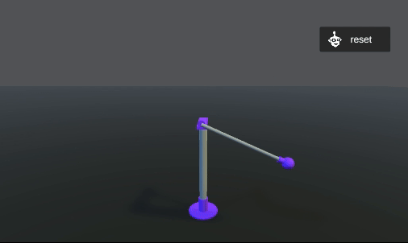

# Workshop
Файлы к воркшопу **Запуск обученной модели ONNX в реальном железе на примере обратного маятника**

Ссылка на [презентацию](https://docs.google.com/presentation/d/1N_wU1ZxaOHyyRAGI6gr8mMF4w-S4YiwxAZw6XnmFZhs)

# Установка
Скачайте Python.zip и .zip файл для вашей операционной системы. Например, на MacOSX скачайте Mac.zip и так далее.

Разархивируйте Python.zip и создайте и активируйте virtual environment (venv) в IDE или терминале.
Установите зависимости командой `pip install -r requirements.txt`

